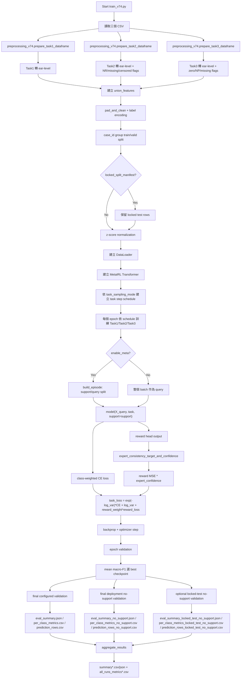
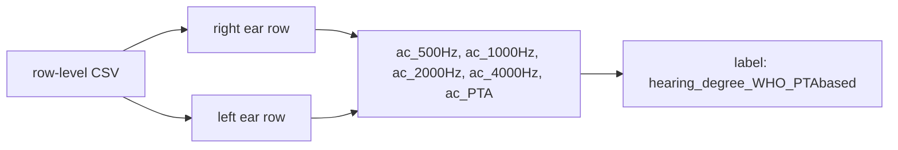
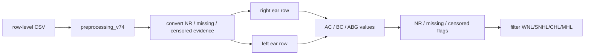
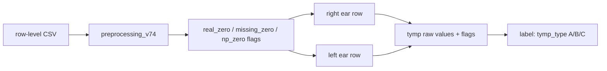
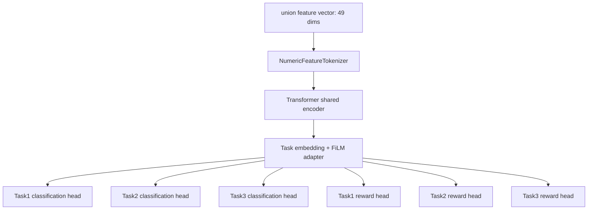
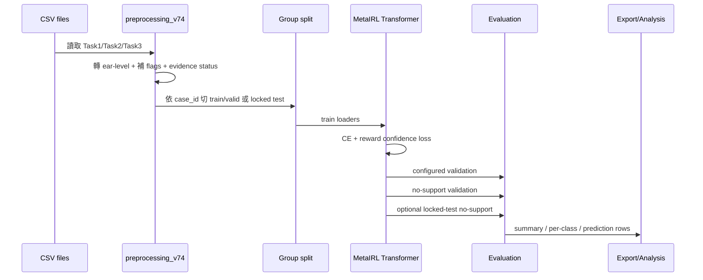
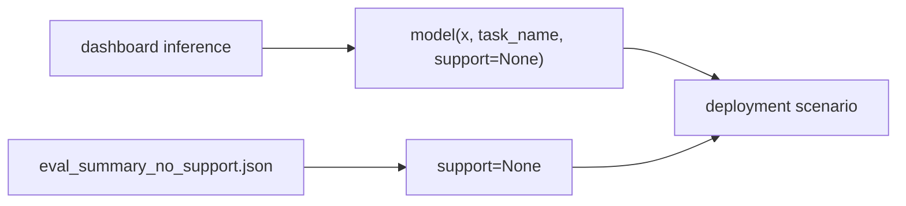
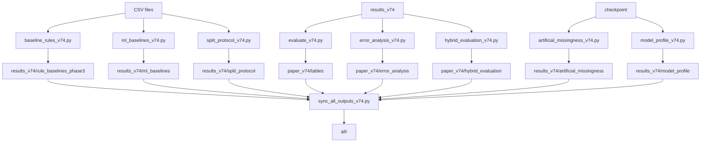
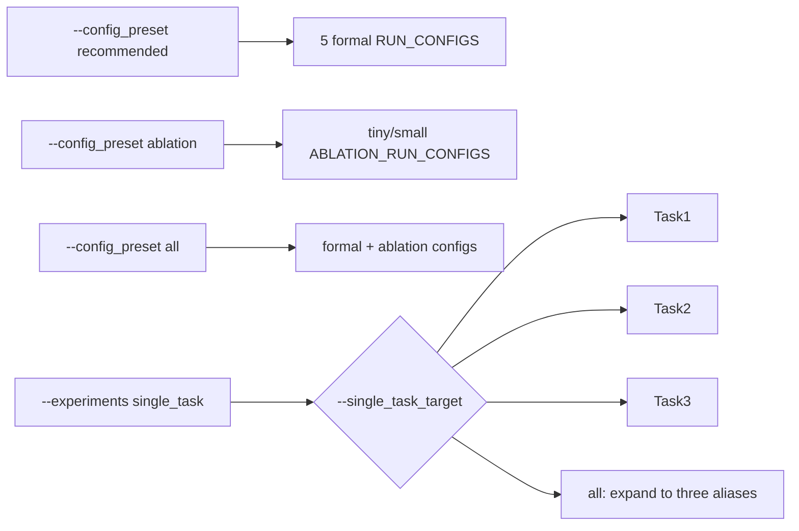
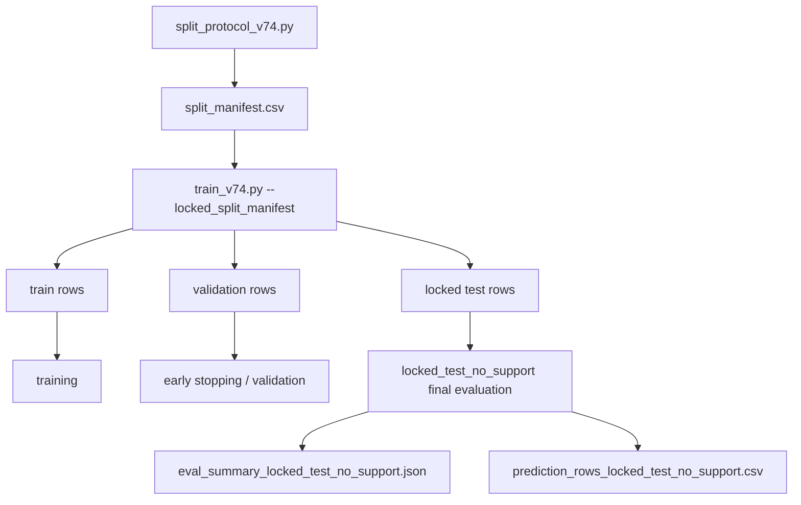

# train_v74.py 完整訓練流程圖

<!-- 2026-06-20-edge-profile-deferred -->

## 2026-06-20 決策：暫不執行 edge 端估計

目前先不把 edge/deployment latency profile 作為本輪必跑項目。主流程優先保留模型訓練、locked-test、rule/model/hybrid、missingness robustness、calibration 與 baseline 結果；`model_profile_v74.py` 與 `results_v74/model_profile/` 先列為後續需要 edge / IoMT deployment 敘事時再單獨補跑的項目。

<!-- 2026-06-19-codex-update -->

## 2026-06-19 Update: P0/P1 and full pipeline

Status: P0/P1 code changes are implemented and checked against the actual scripts, not only against the suggestion text.

Implemented changes:
- `clinical_rules_v74.py`: added `RuleDecision` for rule label, coverage, confidence, compatible labels, and warning flags.
- `preprocessing_v74.py`, `train_v74.py`, `dashboard_three_tasks_metaIRL_v74.py`, and `error_analysis_v74.py`: aligned rule/reward/dashboard/error-analysis logic with the shared rule decision.
- `train_v74.py`: added training-only structured missingness augmentation and added `run_06_rr_k1_small_missingaug_r010` plus `run_07_rr_k1_small_missingaug_noirl`.
- `artificial_missingness_v74.py`: added structured Task2/Task3 missingness scenarios and model-only/rule-forced/rule-abstain-as-error/hybrid-rule-first strategy outputs.
- `ml_baselines_v74.py`: added `ml_baseline_summary_5seed.csv` and `ml_baseline_per_class_5seed.csv` aliases.
- `model_profile_v74.py`: added `model_profile_summary.csv` for latency, parameters, checkpoint size, and estimated FP32 parameter memory.
- `hybrid_evaluation_v74.py`: separated no-support and locked-test output filenames so locked-test no longer overwrites `main_hybrid_summary.csv`.
- `run_all_v74.py`: reordered the real pipeline as compile -> split protocol -> train with locked manifest -> baselines -> error/evaluate -> no-support hybrid -> locked-test hybrid -> calibration -> artificial missingness -> model profile -> sync -> verify.

Main command:
```powershell
& "C:\Users\ASUS\anaconda3\envs\project2\python.exe" run_all_v74.py --python "C:\Users\ASUS\anaconda3\envs\project2\python.exe"
```

Verification already completed:
- project2 venv full `py_compile` passed.
- `run_all_v74.py --dry-run` showed the corrected order and complete command chain.
- `sync_all_outputs_v74.py` required-file list check returned `missing_files=[]`.

<!-- /2026-06-19-codex-update -->


更新日期：2026-06-12  
適用版本：目前 v7.4 專案、正式輸出與 `all/` 同步狀態

## 1. 主訓練流程



## 2. Feature 處理說明

### Task1



Task1 feature 數：5。

### Task2



Task2 feature 數：32。

Task2 不使用 `ac_mean`、`bc_mean`、`abg_mean` 作為模型核心 feature，也不使用它們作為 hearing type rule。

### Task3



Task3 feature 數：16。

## 3. 分頭原理



分頭的意思：

- 三個 task 共用 encoder。
- 每個 task 有自己的 classification head。
- 每個 task 也有自己的 reward head。
- `log_vars` 讓不同 task 的 loss 有 uncertainty weighting。
- meta support 存在時，prototype 會輔助 logits。
- no-support 或 dashboard 情境則不使用 support。

## 4. 根據的指標

訓練期間選 best checkpoint 主要看：

- 各 task / label 的 macro-F1 平均
- validation loss 用於 scheduler / early stopping 輔助

每個 final evaluation 輸出：

- accuracy
- macro-F1
- balanced accuracy
- AUC
- per-class precision / recall / F1 / support

分析時建議優先看：

1. `paper_v74/tables/summary_no_support_all_configs.csv`
2. `paper_v74/tables/per_class_no_support_all_configs.csv`
3. `paper_v74/error_analysis/subgroup_metrics.csv`
4. `paper_v74/error_analysis/rule_model_conflict_summary.csv`

## 5. 模型怎麼使用、順序



## 6. No-support 與 dashboard



因此 dashboard 結果應優先和 no-support outputs 比較。dashboard 也會透過 `preprocessing_v74.clinical_warning_summary()` 顯示 rule label、abstain rule label、evidence status、rule confidence、rule-model conflict 與 warning reasons。

## 7. 後處理與論文輔助流程

以下腳本不在 training loop 裡，而是訓練後或獨立執行：



目前狀態：

| 流程 | 狀態 |
|---|---|
| `evaluate_v74.py` no-support export | 正式 `paper_v74/tables` 已產生。 |
| `baseline_rules_v74.py` phase3 | 正式 `results_v74/rule_baselines_phase3` 已產生。 |
| `ml_baselines_v74.py` | 正式 `results_v74/ml_baselines` 已產生。 |
| `error_analysis_v74.py` | 正式 `paper_v74/error_analysis` 已產生。 |
| `split_protocol_v74.py` | 正式 `results_v74/split_protocol` 已產生。 |
| `artificial_missingness_v74.py` | 正式 `results_v74/artificial_missingness` 已產生。 |
| `model_profile_v74.py` | 正式 `results_v74/model_profile` 已產生。 |
| `hybrid_evaluation_v74.py` | 正式 `paper_v74/hybrid_evaluation` 已產生。 |
| `sync_all_outputs_v74.py` | `all/` 已同步主要程式、md、CSV 與正式輸出。 |

## 8. Single-task 與 ablation



## 9. Locked-test evaluation



## 10. 驗證狀態

目前已確認：

- 主要 `.py` 檔案可通過 `py_compile`。
- Task2 rule 對 CSV：174 rows、mismatch=0、uncertain evidence=75。
- no-support training outputs 已可產生。
- paper tables、ML baseline、rule baseline phase3、error analysis、split protocol、artificial missingness、model profile、hybrid evaluation 已有正式輸出。
- `all/` 已同步主要程式、md、CSV 與正式輸出。

注意：根目錄 `all.zip` 是舊壓縮檔，不代表目前最新版 `all/`。

---

## 2026-06-18 完整流程更新

目前完整流程由 `run_all_v74.py` 統一調度：compile → split protocol → train → rule baseline → ML baselines → error analysis with rule merge → evaluate paper tables → hybrid rule-first summary → calibration analysis → artificial missingness → deployment profile → optional locked-test runner → sync all → verify。正式 locked-test 不直接混入 `results_v74`，需用 `run_all_v74.py --run-locked-test --locked-allow-overwrite` 或獨立 `run_locked_test_v74.py --allow-overwrite`。

一般快速檢查建議先跑 `python run_all_v74.py --dry-run` 與 `python run_all_v74.py --compile-only`；正式全流程會很重，尤其 train、ML baseline、artificial missingness、locked-test。

## 2026-06-21 run_all_v74.py ?????
????????

1. `python -m py_compile ...`????? root Python?
2. `split_protocol_v74.py`??? grouped locked-test split manifest?
3. `train_v74.py`??? full/no_meta/no_irl/single_task?
4. `baseline_rules_v74.py`?clinical rule baseline?
5. `ml_baselines_v74.py`?classical ML baseline?
6. `error_analysis_v74.py`?true/rule/model ?? conflict ? subgroup analysis?
7. `evaluate_v74.py`?paper tables/figures?
8. `hybrid_evaluation_v74.py --mode no_support`?
9. `hybrid_evaluation_v74.py --mode locked_test`?
10. `calibration_analysis_v74.py`?
11. `artificial_missingness_v74.py`?
12. `feature_importance_v74.py`?
13. `model_profile_v74.py`?
14. optional `run_locked_test_v74.py`?
15. `sync_all_outputs_v74.py --clean --skip-large-predictions`?
16. `verify_key_outputs()`?

?????

```powershell
python run_all_v74.py
```

???? edge/model profile?

```powershell
python run_all_v74.py --skip-model-profile
```

## 2026-06-21 ???????15 ??? + 5 ??
??????????

- `RUN_CONFIGS = 15`?3 ??????base/small/tiny??? 5 ? masking profile?
- `ABLATION_RUN_CONFIGS = 5`?5 ??????????? training masking?
- `--config_preset recommended` ?? 15 ?????
- `--config_preset ablation` ?? 5 ????
- `--config_preset all` ?? 20 ??

?????? `missing_aug_p > 0`?? `missing_aug_strategy_weights` ???? `Task1`?`Task2`?`Task3`??? Task1 ?? masking strategy?`mask_pta`?`mask_high_freq`?`mask_low_freq`?`mask_all_ac`?

??????
- base: `run_01` ? `run_05`
- small: `run_06` ? `run_10`
- tiny: `run_11` ? `run_15`
- masking profile: `m05_balanced`?`m10_balanced`?`m15_bc_dominant`?`m15_tymp_dominant`?`m20_heavy_balanced`

?????
- `ablation_base_m10_equal_steps_r015`
- `ablation_base_m10_rr_k4_r015`
- `ablation_base_m10_support2_r015`
- `ablation_base_m20_high_reward_r020`
- `ablation_base_m30_stress_r010`

?? checkpoint ??? `run_02_base_m10_balanced_r015/full_seed_0/best_model.pth`??????? clinical masking baseline?
