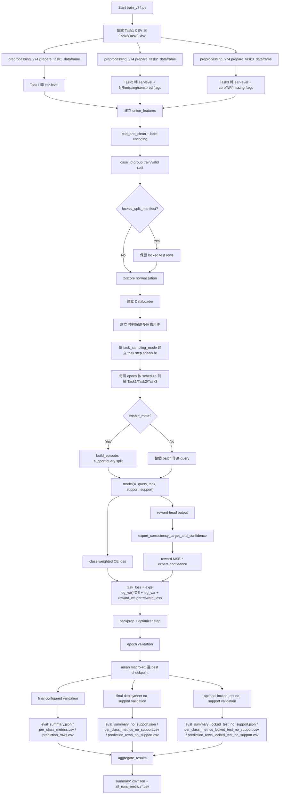
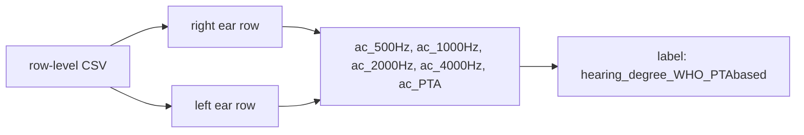
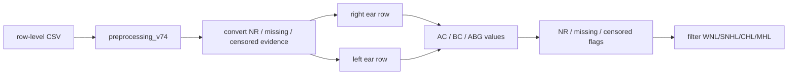
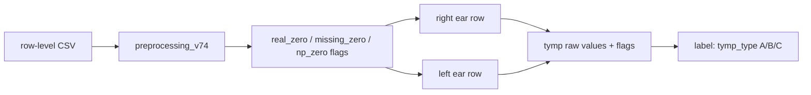
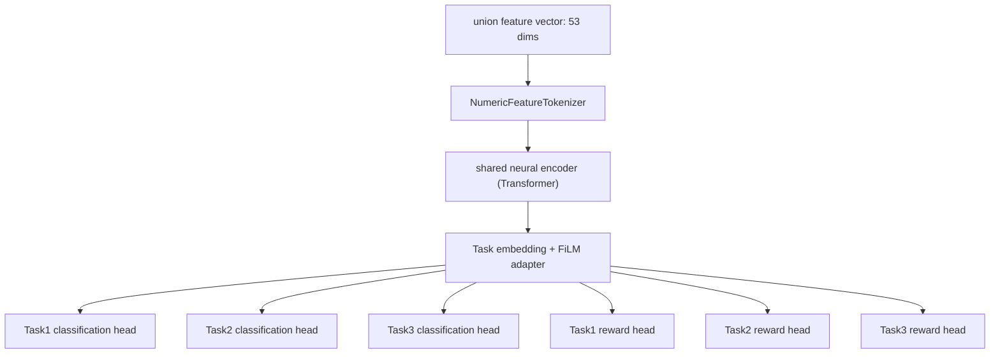
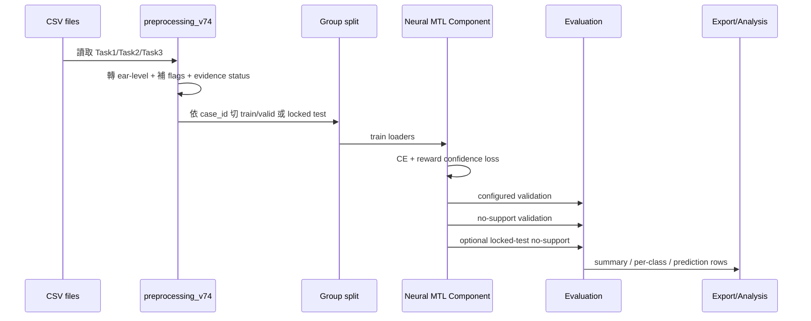
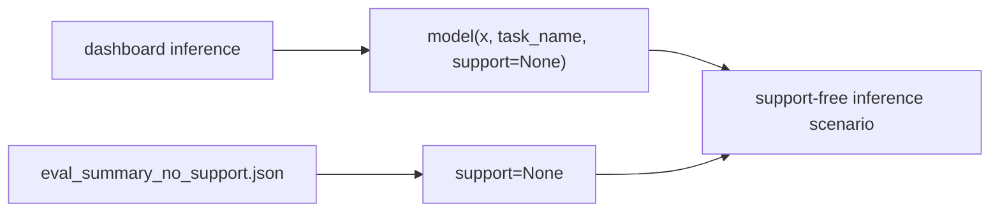
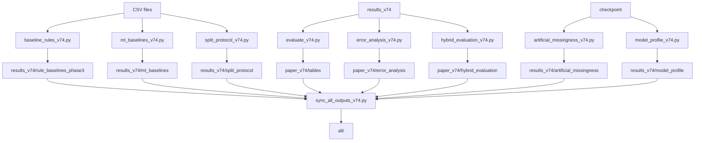
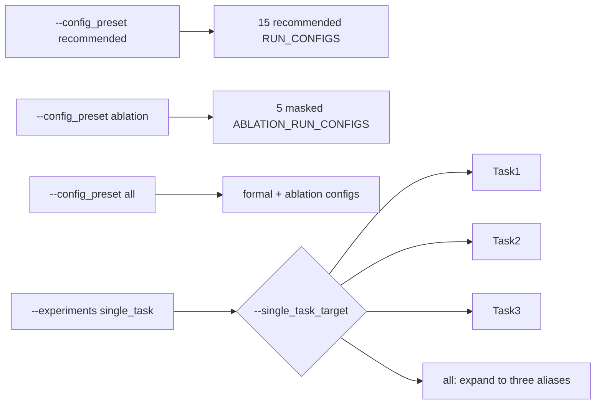
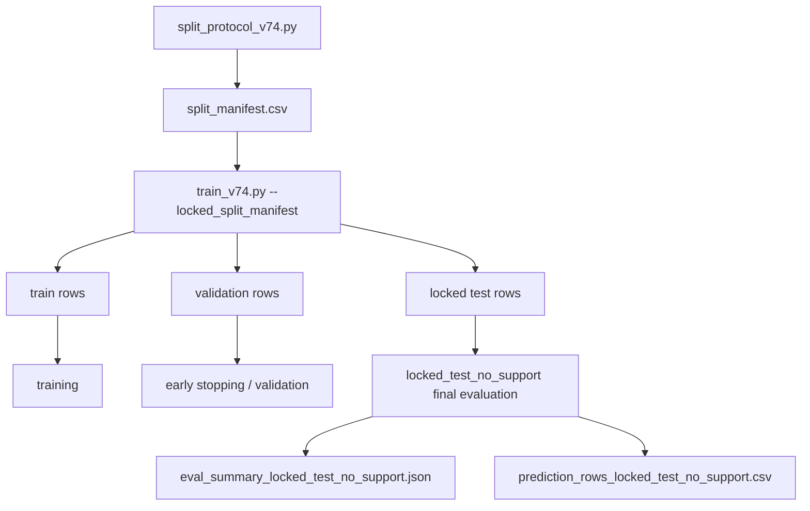

<!-- 2026-07-08-hard-warning-taxonomy-update -->
## 2026-07-08 Full-flow output update

The full pipeline now treats the following files as required analysis outputs:

- Step 5 / `error_analysis_v74.py`: `paper_v74/error_analysis/task2_rule_label_conflict_audit.csv`.
- Step 9 / `artificial_missingness_v74.py`: `results_v74/artificial_missingness/clinical_missingness_taxonomy.csv`.
- Step 9 / paper tables: `paper_v74/tables/clinical_missingness_taxonomy.csv`.

The official hybrid gate is now shared across batch evaluation, missingness stress tests, model profiling, and the dashboard through `clinical_rules_v74.has_hard_rule_warning()`.

<!-- /2026-07-08-hard-warning-taxonomy-update -->

<!-- 2026-07-08-directional-abg-rule-gate -->

## 2026-07-08 Current Rule and Hybrid Gate

This block records the current code behavior. If older historical sections mention the old absolute-gap formula, the old 10 dB ABG rule, or direct Task3 B/C hard labels, this block is authoritative.

### Task2 directional ABG

- Task2 rule no longer uses the old absolute-gap formula.
- Meaningful ABG is directional: `AC - BC >= 15 dB`.
- `BC - AC >= 15 dB` is not ABG. It is flagged as `negative_abg_or_measurement_inconsistency` and falls back to the model.
- `10 <= AC - BC < 15 dB` is `abg_borderline`; it does not trigger CHL/MHL and falls back to the model.
- AC 6000/8000 Hz is model input and supplemental warning evidence only. It does not independently decide SNHL in the rule path.

### Task2 rule-first gate

- Forced rule labels may still output WNL/SNHL/CHL/MHL for baseline analysis.
- Official rule-first currently allows only covered `SNHL` and `WNL` cases.
- `MHL` and `CHL` are kept for forced-rule analysis but are blocked from official hybrid rule-first because the current labels and simplified numeric rules still conflict for those classes.
- Missing data, borderline ABG, negative ABG, high-frequency-only abnormality, and unclear rule combinations all set `baseline_covered=False` and fall back to the model.

### Task3 rule-first gate

- `peak NP + compliance NP` remains valid Type B evidence.
- `peak_daPa <= -300` and `-300 < peak_daPa <= -150` are B/C-uncertain and fall back to the model.
- `peak_daPa > -150` can be rule-first Type A only when there is no low-compliance or wide-width warning.
- `compliance < 0.20` or `width >= 200` is A/B-uncertain and falls back to the model.
- Vea missing is an evidence warning only; it does not decide A/B/C by itself.

### Hybrid gate

Official hybrid uses rule only when all conditions hold: valid `rule_decision_label`, `baseline_covered=True`, `complete_for_rule=True`, `rule_confidence >= 0.8`, and no hard warning in `warning_reasons`. Otherwise it uses the model prediction, with low-confidence abstain only when model confidence is below threshold. `rule_forced` is analysis-only and is not the deployed decision policy.

<!-- /2026-07-08-directional-abg-rule-gate -->

<!-- 2026-07-05-device-routing-update -->

## 2026-07-05 GPU/CPU 流程分工

目前完整流程仍以 `run_all_v74.py` 統一調度，但 device 不再寫死 CPU：

| Step | 腳本 | 裝置控制 | 說明 |
|---|---|---|---|
| 0 | `python -m py_compile` | CPU | 語法檢查。 |
| 1 | `split_protocol_v74.py` | CPU | 建立 grouped locked-test split。 |
| 2 | `train_v74.py` | `--device` | 預設 `auto`，正式長跑建議 `--device cuda`。 |
| 3 | `baseline_rules_v74.py` | CPU | clinical rule baseline，無神經網路推論。 |
| 4 | `ml_baselines_v74.py` | CPU | sklearn / classical ML baseline。 |
| 5 | `error_analysis_v74.py` | CPU | 合併 prediction rows 與 rule/model/true label conflict。 |
| 6 | `evaluate_v74.py` | CPU | 輸出 paper tables / figures。 |
| 7a/7b | `hybrid_evaluation_v74.py` | CPU | 合併 rule/model prediction，計算 hybrid summary。 |
| 8a/8b | `calibration_analysis_v74.py` | CPU | ECE、Brier、confidence threshold 統計。 |
| 9 | `artificial_missingness_v74.py` | `--device` | 大量 checkpoint forward inference，正式建議 GPU。 |
| 10 | `feature_importance_v74.py` | `--device` | 大量 ablation / permutation forward inference，正式建議 GPU。 |
| 11 | `model_profile_v74.py` | `--profile-device` | optional；預設 CPU，保留 edge/profile latency 意義。 |
| 12 | `run_locked_test_v74.py` | `--device` 傳給內部 training | optional formal locked-test pipeline。 |
| 13 | `sync_all_outputs_v74.py` | CPU | 同步正式輸出到 `all/`。 |
| 14 | internal verify | CPU | 檢查必要輸出檔是否存在。 |

建議正式執行：

```powershell
python run_all_v74.py --skip-model-profile --device cuda
```

若要包含 optional locked-test runner：

```powershell
python run_all_v74.py --skip-model-profile --run-locked-test --locked-allow-overwrite --device cuda
```

<!-- /2026-07-05-device-routing-update -->
<!-- 2026-07-01-inline-run-configs -->

## 2026-07-01 目前參數設定狀態

本專案已取消外部參數檔。正式訓練參數集中在 `train_v74.py` 內維護：

- `MODEL_SIZE_CONFIGS`：base / small / tiny 的模型大小設定。
- `MISSING_AUG_PROFILES`：Task1、Task2、Task3 的缺失資料 augmentation 權重。
- `RUN_CONFIGS`：15 組正式訓練參數。
- `ABLATION_RUN_CONFIGS`：5 組 ablation 參數。

`train_v74.py` 仍使用 `--config_preset recommended|ablation|all` 選擇要跑正式組、ablation 組或全部 20 組。`run_all_v74.py` 與 `run_locked_test_v74.py` 不再接受外部參數檔路徑。若要改參數或分電腦跑，請直接在同一套程式的 `train_v74.py` 內調整參數組合或自行改要執行的 config，不再使用外部分工檔。同步程式也不再同步舊 config 目錄，正式封包中的舊 config 目錄已清除。

<!-- /2026-07-01-inline-run-configs -->
# train_v74.py 完整訓練流程圖

<!-- 2026-06-27-narrative-alignment -->

## 2026-06-27 文字敘事與命名收斂

本段為目前對外說明的優先採信版本。後續給 GPT、教授或論文草稿分析時，請先以本段理解研究定位；較早日期段落若仍出現舊名稱或舊數字，只作歷史紀錄，不作為目前主張。

目前研究主軸不是單純的神經網路架構或模型準確率比較，而是：

```text
Missing-aware clinical-rule-guided hybrid decision-support framework
for ear-level hearing classification under incomplete audiological evidence.
```

中文定位：聽力師規則引導、缺值感知的混合式聽力輔助判讀系統。

目前敘事原則：
- `MetaIRL`、Transformer、prototype/meta-learning 只作為神經網路元件或消融模組，不作為唯一主貢獻。
- 主要臨床問題是 Task2/Task3 在缺失、NR/截尾值、ABG 邊界值、無 peak / 無 tympanogram 等不完整證據下的可靠輔助判讀。
- 混合式決策的價值是規則優先、模型回退、警示、暫不判讀與規則-模型衝突透明化；不可寫成混合式決策已全面高於規則決策。
- 傳統機器學習基準很強；若實驗協定不同，只能說是具競爭力的 grouped validation 基準，不能直接與 locked-test 神經網路結果作公平勝負結論。
- 人工缺失分析目前是強健性壓力測試證據；除非對齊主要設定與 5 seeds，否則不要寫成最終主要強健性結果。
- IoMT / 部署目前應寫成概念性臨床決策輔助流程；邊緣端 latency/profile 不是本輪主軸，device-shift 主張需等有 device-level 驗證後再放入。
- `all/` 是給 GPT/教授分析的封包；可包含目前使用的原始資料，但沒有 checkpoint 與大型逐列預測時，仍不是完整可重跑的 execution-ready 封包。

<!-- /2026-06-27-narrative-alignment -->

<!-- 2026-06-26-current-flow-alignment -->

## 2026-06-26 目前完整流程與分散式訓練說明

目前程式碼對齊重點：
- Task1 資料來源：`task1_all_three_common14_v1.csv`。
- Task2/Task3 資料來源：`task2_3_pure_data(6_24).xlsx`。
- 目前特徵數：Task1 = 5、Task2 = 36、Task3 = 16、三任務 union = 53。
- Task2 模型輸入包含 AC 500/1000/2000/4000/6000/8000 Hz、六頻 AC NR 標記、BC 500/1000/2000/4000 Hz、BC NR/缺失標記、ABG 500/1000/2000/4000 Hz 的數值/缺失/截尾標記。
- Task2 規則使用 AC 500/1000/2000/4000 Hz，加上 6000/8000 Hz 至少一個高頻存在作為完整性條件；ABG 以 `AC-BC>=15 dB` 判定 clear ABG，`10<=AC-BC<15 dB` 作邊界警示。
- Task3 current rule: peak <= -150 is B/C-uncertain and falls back to model; clear A requires peak > -150 without low-compliance or wide-width warning.
- 混合式決策的規則優先策略改以 `rule_confidence` / `rule_evidence_score` 門檻決定是否採用規則；分數達門檻時採用 rule，分數不足時交由模型，若模型信心度低於門檻則可暫不判讀。
- `train_v74.py 內建 RUN_CONFIGS/ABLATION_RUN_CONFIGS` 為完整 20 組設定：15 組 `run_configs` 加 5 組 `ablation_run_configs`。
- `all/` 預設是給 GPT/教授分析的 `analysis_only` 封包；可用 `--include-raw-data` 納入目前使用的原始資料，但未包含 checkpoint 與大型逐列預測時，仍不是完整可重跑封包。
- 本輪邊緣端/model profile 仍可用 `--skip-model-profile` 延後，不作為目前主流程必跑項。

目前 `run_all_v74.py` 主流程：

| Step | Script / Action | 意義 | 主要輸出 |
|---|---|---|---|
| 0 | `python -m py_compile` | 檢查 root Python 語法 | 無錯誤即可 |
| 1 | `split_protocol_v74.py` | 建立 grouped locked-test split | `results_v74/split_protocol/split_manifest.csv`, `split_summary.csv` |
| 2 | `train_v74.py` | 依內建 config 訓練 full/no_meta/no_irl/single_task，並帶入 locked split manifest | `results_v74/five_runs/**/best_model.pth`, 逐筆預測列, no-support 與 locked-test no-support 指標 |
| 3 | `baseline_rules_v74.py` | 缺值感知臨床規則基準 | `results_v74/rule_baselines_phase3/` |
| 4 | `ml_baselines_v74.py` | 傳統機器學習基準 | `results_v74/ml_baselines/` |
| 5 | `error_analysis_v74.py --mode all` | configured/no-support/locked-test 三方衝突與 safety 分析 | `paper_v74/error_analysis/` |
| 6 | `evaluate_v74.py` | 論文表格/圖 與統計摘要 | `paper_v74/tables/` |
| 7a | `hybrid_evaluation_v74.py --mode no_support` | no-support 混合式決策規則優先評估 | `paper_v74/hybrid_evaluation/`, `main_hybrid_summary.csv` |
| 7b | `hybrid_evaluation_v74.py --mode locked_test` | locked-test 混合式決策規則優先評估 | `main_hybrid_summary_locked_test.csv` |
| 8a | `calibration_analysis_v74.py --mode both` | configured/no-support 校準 | `results_v74/calibration_analysis/` |
| 8b | `calibration_analysis_v74.py --mode locked_test` | locked-test 校準 | `results_v74/calibration_analysis_locked_test/` |
| 9 | `artificial_missingness_v74.py` | 不完整聽力資料強健性 | `results_v74/artificial_missingness/` |
| 10 | `feature_importance_v74.py` | 特徵群組 permutation importance 與 inference-time ablation | `results_v74/feature_importance/` |
| 11 | `model_profile_v74.py` | 可選 latency/profile 估計 | `results_v74/model_profile/` |
| 12 | `run_locked_test_v74.py` | 可選獨立 locked-test 流程 | `results_v74_locked_test/`, `paper_v74_locked_test/` |
| 13 | `sync_all_outputs_v74.py` | 同步 `all/` 封包 | `all/sync_manifest_v74.json` |
| 14 | internal verify | 檢查主要輸出是否存在 | 無缺失輸出 error |


<!-- /2026-06-26-current-flow-alignment -->

<!-- 2026-06-25-p0-p4-gpt-analysis-update -->

## 2026-06-25 P0-P4 GPT 分析回應更新

本次更新是在核對目前程式碼、最新版 GPT all.zip 分析與教授回饋後完成。目標是讓專案從只看模型分數的敘事，收斂為缺值感知、臨床規則引導、可追溯 locked-test 的決策輔助流程。

已完成更新：
- `sync_all_outputs_v74.py` 現在會標示封包類型：`analysis_only`、`execution_ready` 或 `custom`。
- sync manifest 會明確記錄是否包含原始資料、checkpoint 與大型逐列預測檔案。
- `run_all_v74.py` 會把封包旗標傳給同步流程，並驗證 `sync_manifest_v74.json` 是否符合執行參數。
- `run_locked_test_v74.py` 現在會產生 locked-test error analysis、三方衝突表、校準摘要、ECE bins、Brier score 與信心度門檻 curves。
- `run_all_v74.py` 現在會建立 `results_v74/calibration_analysis_locked_test/`，並用 `--mode all` 執行 error analysis。
- 混合式決策輸出現在包含 `hybrid_decision_reason`、`hybrid_warning_reasons` 與決策原因摘要 CSV。
- 人工缺失現在會針對 incomplete 或 corrupted stress scenario 採用較保守的 scenario-level 模型回退。
- Task2 artificial ABG 邊界 stress 現在使用 10 dB 而不是 15 dB，使其代表邊界而非明確 ABG。
- Error analysis 現在會輸出 `decision_safety_summary.csv`。
- Dashboard 現在會顯示模型信心度、混合式決策原因與低信心度暫不判讀。
- `evaluate_v74.py` 現在會輸出 `statistical_summary_all_configs.csv`，包含 mean、std、SEM 與 clipped 95% CI。

建議正式刷新指令：

```powershell
python run_all_v74.py --skip-model-profile --run-locked-test --locked-allow-overwrite --package-type analysis_only
```

只有在需要可重跑的大型封包時才使用：

```powershell
python run_all_v74.py --skip-model-profile --run-locked-test --locked-allow-overwrite --package-type execution_ready
```

<!-- /2026-06-25-p0-p4-gpt-analysis-update -->


<!-- 2026-06-20-邊緣端-profile-deferred -->

## 2026-06-20 決策：暫不執行 邊緣端估計

目前先不把 邊緣端/部署 latency profile 作為本輪主軸。主流程優先保留模型訓練、locked-test、規則/模型/混合式決策、缺失狀態 強健性、校準、特徵重要性 與 基準 結果；`model_profile_v74.py` 與 `results_v74/model_profile/` 先列為後續需要補強 IoMT 可部署性敘事時再單獨補跑的項目。

<!-- 2026-06-19-codex-update -->

## 2026-06-19 完整流程更新

`run_all_v74.py` 現在是主要完整流程入口。它會先建立 grouped locked-test split，再把 `--locked_split_manifest` 傳給 `train_v74.py`，因此主流程可以同時產生 no-support 與 locked-test no-support 輸出。

使用 project2 環境執行：
```powershell
& "C:\Users\ASUS\anaconda3\envs\project2\python.exe" run_all_v74.py --python "C:\Users\ASUS\anaconda3\envs\project2\python.exe"
```

主要預期輸出包含 `main_hybrid_summary.csv`、`main_hybrid_summary_locked_test.csv`、`three_way_conflict_summary.csv`、`ml_baseline_summary_5seed.csv`、`artificial_missingness_summary.csv` 與 `model_profile_summary.csv`。

<!-- /2026-06-19-codex-update -->


更新日期：2026-06-12  
適用版本：目前 v7.4 專案、正式輸出與 `all/` 同步狀態

## 1. 主訓練流程



## 2. 特徵 處理說明

### Task1



Task1 特徵 數：5。

### Task2



Task2 特徵 數：36。

Task2 不使用 `ac_mean`、`bc_mean`、`abg_mean` 作為模型核心 特徵，也不使用它們作為 hearing type rule。

### Task3



Task3 特徵 數：16。

## 3. 分頭原理



分頭的意思：

- 三個 task 共用 encoder。
- 每個 task 有自己的 classification head。
- 每個 task 也有自己的 reward head。
- `log_vars` 讓不同 task 的 loss 有 uncertainty weighting。
- meta support 存在時，prototype 會輔助 logits。
- no-support 或 dashboard 情境則不使用 support。

## 4. 根據的指標

訓練期間選 best checkpoint 主要看：

- 各 task / label 的 macro-F1 平均
- 驗證 loss 用於 scheduler / early stopping 輔助

每個 final 評估 輸出：

- accuracy
- macro-F1
- balanced accuracy
- AUC
- per-class precision / recall / F1 / support

分析時建議優先看：

1. `paper_v74/tables/summary_no_support_all_configs.csv`
2. `paper_v74/tables/per_class_no_support_all_configs.csv`
3. `paper_v74/error_analysis/subgroup_metrics.csv`
4. `paper_v74/error_analysis/rule_model_conflict_summary.csv`

## 5. 模型怎麼使用、順序



## 6. No-support 與 dashboard



因此 dashboard 結果應優先和 no-support 輸出 比較。dashboard 也會透過 `preprocessing_v74.clinical_warning_summary()` 顯示 規則 label、暫不判讀 規則 label、證據狀態、規則信心度、規則-模型衝突 與 警示原因。

## 7. 後處理與論文輔助流程

以下腳本不在 訓練 loop 裡，而是訓練後或獨立執行：



目前狀態：

| 流程 | 狀態 |
|---|---|
| `evaluate_v74.py` no-support export | 正式 `paper_v74/tables` 已產生。 |
| `baseline_rules_v74.py` phase3 | 正式 `results_v74/rule_baselines_phase3` 已產生。 |
| `ml_baselines_v74.py` | 正式 `results_v74/ml_baselines` 已產生。 |
| `error_analysis_v74.py` | 正式 `paper_v74/error_analysis` 已產生。 |
| `split_protocol_v74.py` | 正式 `results_v74/split_protocol` 已產生。 |
| `artificial_missingness_v74.py` | 正式 `results_v74/artificial_missingness` 已產生。 |
| `model_profile_v74.py` | 正式 `results_v74/model_profile` 已產生。 |
| `hybrid_evaluation_v74.py` | 正式 `paper_v74/hybrid_evaluation` 已產生。 |
| `sync_all_outputs_v74.py` | `all/` 已同步主要程式、md、CSV 與正式輸出。 |

## 8. Single-task 與 ablation



## 9. Locked-test 評估



## 10. 驗證狀態

目前已確認：

- 主要 `.py` 檔案可通過 `py_compile`。
- Task2 rule 對 CSV：174 rows、mismatch=0、uncertain 證據=75。
- no-support 訓練 輸出 已可產生。
- paper tables、ML 基準、rule 基準 phase3、error 分析、split protocol、人工缺失、model profile、混合式決策 評估 已有正式輸出。
- `all/` 已同步主要程式、md、CSV 與正式輸出。

注意：根目錄 `all.zip` 是舊壓縮檔，不代表目前最新版 `all/`。

---

## 2026-06-18 完整流程更新

目前完整流程由 `run_all_v74.py` 統一調度：compile → split protocol → train → rule 基準 → ML 基準 → error 分析 with rule merge → evaluate paper tables → 混合式決策 規則優先 摘要 → 校準 分析 → 人工缺失 → 部署 profile → optional locked-test runner → sync all → verify。正式 locked-test 不直接混入 `results_v74`，需用 `run_all_v74.py --run-locked-test --locked-allow-overwrite` 或獨立 `run_locked_test_v74.py --allow-overwrite`。

一般快速檢查建議先跑 `python run_all_v74.py --dry-run` 與 `python run_all_v74.py --compile-only`；正式全流程會很重，尤其 train、ML 基準、人工缺失、locked-test。

## 2026-06-21 run_all_v74.py 流程整理

此歷史段落已整理為可讀摘要：當時 `run_all_v74.py` 已被調整為完整流程入口，順序包含 compile、split protocol、train、rule 基準、ML 基準、error 分析、evaluate、混合式決策 no-support、混合式決策 locked-test、校準、人工缺失、特徵重要性、optional model profile、optional locked-test runner、sync all 與 verify。

常用指令：

```powershell
python run_all_v74.py
python run_all_v74.py --skip-model-profile
```

目前最新流程仍以本文件最上方 2026-06-26 區塊為準。

## 2026-06-21 參數組合 15 組 recommended + 5 組 ablation

此歷史段落已整理為可讀摘要：當時將訓練組合整理為 15 組 `RUN_CONFIGS` 與 5 組 `ABLATION_RUN_CONFIGS`，涵蓋 base/small/tiny 三種模型大小與多種 masking profile。後續已進一步集中在 `train_v74.py 內建 RUN_CONFIGS/ABLATION_RUN_CONFIGS`，；舊外部分工檔已移除，若要分工請直接調整 `train_v74.py` 內的參數組合。


<!-- 2026-06-27-p0-p4-final-alignment -->

## 2026-06-27 P0-P4 收斂後最新說明

### 最新研究定位
本專案目前應定位為：**Missing-aware clinical-rule-guided hybrid decision-support framework for ear-level hearing classification under incomplete audiological evidence**。核心不是單純證明 Transformer 或 MetaIRL 分數較高，而是證明在不完整聽力學資料下，系統能結合臨床規則、模型預測、規則/模型衝突警示、低信心度暫不判讀與 locked-test 可追溯性。

### 目前新增或強化的證據鏈
- `ml_baseline_locked_test_summary_5seed.csv`：補齊 classical ML 在 locked-test 上的公平比較。
- `main_hybrid_summary*.csv`：新增 rule availability、rule failure、rule correction、model fallback success、rule-model conflict、warning rate 等臨床價值指標。
- `hybrid_threshold_sweep*.csv`：用 threshold sweep 說明 confidence gate 不是任意指定。
- `hybrid_strategy_mcnemar*.csv`：提供 strategy-level paired comparison / McNemar 檢定。
- `clinical_error_taxonomy_summary.csv`：將 true label / rule label / model prediction 整理成臨床錯誤 taxonomy。
- `calibration_policy_summary.csv`：把 confidence threshold curve 收斂成可引用的 policy summary。
- `statistical_summary_all_configs.csv`：新增 bootstrap CI 欄位。
- `artificial_missingness_v74.py` 與 `feature_importance_v74.py`：主流程預設改用 `run_13_tiny_m15_bc_dominant_r010/no_meta_seed_*` 作為 primary 5-seed 分析基礎。

### 論文敘事應避免過度主張
- 不應主張 device shift 已完成驗證，除非後續補上 device label 或 cross-device validation。
- 不應主張 Transformer / MetaIRL / IRL 本身是唯一主要貢獻；這些應寫成 neural component 或 ablation factor。
- 不應主張 hybrid 一定全面擊敗 clinical rule；應主張 hybrid 的價值在 rule coverage、model fallback、conflict warning 與 incomplete-data tolerance。
- 邊緣端 latency/profile 目前可作補充，不作本輪主軸；若要寫 IEEE IoT/IoMT，需以概念性 IoMT decision-support pipeline、missingness robustness 與 clinical warning 為主。

### 建議論文主線
1. Subject-level / locked-test traceable split 建立可信評估基礎。
2. Clinical rule baseline 建立可解釋診斷參考。
3. Neural model 補足 rule 無法完整判斷或資料不完整的案例。
4. Hybrid rule-guided framework 整合 rule decision、model fallback、warning 與 abstention。
5. Missingness robustness、feature importance、calibration 與 statistical tests 支撐系統可靠性。

<!-- /2026-06-27-p0-p4-final-alignment -->

<!-- 2026-07-01-task1-missingness-alignment -->
## 2026-07-01 Task1 Missingness Augmentation 對應分析

`train_v74.py` 中 Task1 訓練端已有四種 missingness augmentation：`mask_pta`、`mask_high_freq`、`mask_low_freq`、`mask_all_ac`。本次補齊 `artificial_missingness_v74.py` 的分析端 scenario，使訓練與分析可以一一對應。

| 訓練策略 | 分析 scenario | 遮蔽欄位 |
|---|---|---|
| `mask_pta` | `task1_no_pta` | `ac_PTA` |
| `mask_high_freq` | `task1_no_high_freq` | `ac_2000Hz`、`ac_4000Hz`、`ac_PTA` |
| `mask_low_freq` | `task1_no_low_freq` | `ac_500Hz`、`ac_1000Hz`、`ac_PTA` |
| `mask_all_ac` | `task1_no_all_ac` | Task1 全部 AC feature |

後處理流程不需額外修改 `run_all_v74.py`，因為 Step 9 已使用 `--tasks Task1,Task2,Task3`；新增 Task1 scenarios 後會自然進入人工缺失輸出。
<!-- /2026-07-01-task1-missingness-alignment -->
## 2026-07-02 最新規則更新：Rule Evidence Score 與 Hybrid Gating

- Task2 clear ABG 現在定義為 `AC-BC >= 15 dB`。
- Task2 borderline ABG 現在定義為 `10 <= AC-BC < 15 dB`；borderline 不直接觸發 CHL/MHL，只扣 rule evidence score 0.1 並加上 `abg_borderline` warning。
- Task2 的 `rule_forced` 仍保留硬判 label；但正式 rule-first / hybrid 是否採用 rule，改由 `rule_confidence` / `rule_evidence_score` 門檻控制。
- Task2 score 起始為 1.0：缺 core AC 扣 0.15；6000/8000 兩者都缺扣 0.05；BC 部分缺失整組扣 0.3；no BC data 直接壓到 0.5；NR/censored 只加 warning，不當 missing。
- Task3 evidence score 納入 `tymp_Vea` 缺失檢查；Vea 缺失只扣 0.05 並加 warning，不直接改 A/B/C label。
- Task3 `peak_daPa` 缺失時 score 最高 0.5；`peak NP + compliance NP` 視為有效 B 型證據；`-300 < peak_daPa <= -150` 為 C 區間但扣 0.2，並保留 C/B compatible label。
- Hybrid rule-first 現在使用 score gating：`rule_confidence >= 0.8` 且 rule label 存在時採用 rule；score 不足時 fallback model；model confidence 低於門檻時可輸出 `INSUFFICIENT_EVIDENCE`。
- 新增或保留的輸出欄位包含 `rule_evidence_score`、`score_deductions`、`rule_confidence`、`warning_reasons`、`hybrid_decision_reason`。
- 注意：依目前資料暫存檢查，`AC-BC>=15` 搭配「任一頻率有 clear ABG 即判 CHL/MHL」會明顯拉低 Task2 rule-forced 表現；這是規則定義的結果，不是流程錯誤，後續若要改善需再討論是否加入「至少兩個非 censored ABG 頻率」等條件。
## 2026-07-02 run_all_v74.py 最新流程補充

完整流程現在在 hybrid、missingness、feature importance、calibration 階段額外產生 paper-ready tables：
- Step 7a/7b hybrid_evaluation_v74.py：輸出 main_hybrid_summary、rule_contribution_summary、hybrid_explainability_summary、main_method_comparison。
- Step 8a/8b calibration_analysis_v74.py：輸出 calibration_summary_paper 與 calibration_summary_paper_locked_test。
- Step 9 artificial_missingness_v74.py：輸出 missingness_degradation_summary、missingness_evidence_compensation_summary、missingness_hybrid_reason_summary。
- Step 10 feature_importance_v74.py：輸出 feature_importance_summary、feature_group_importance_summary、feature_missingness_link_summary。

verify_key_outputs() 已加入上述輸出檢查；若完整流程缺少任何正式表格，run_all 會在最後驗證階段報錯。
